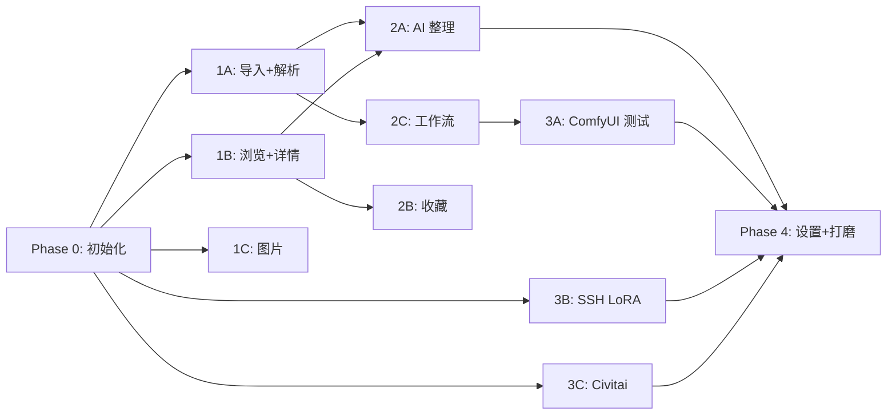

# PromptForge · 开发任务表

> **版本**：v1.0 | **日期**：2026-03-05  
> **估算单位**：人天（1 人天 ≈ 6-8 小时有效编码）

---

## Phase 0：项目初始化（~2 天）

| #   | 任务                                         | 预估 | 依赖 | 验收标准                     |
| --- | -------------------------------------------- | ---- | ---- | ---------------------------- |
| 0.1 | 初始化 Electron + Vite + React/Vue 脚手架    | 0.5d | -    | `npm run dev` 可启动空白窗口 |
| 0.2 | 配置 TypeScript / ESLint / Prettier          | 0.5d | 0.1  | lint 通过，类型检查通过      |
| 0.3 | 搭建目录结构（main/renderer/shared/preload） | 0.5d | 0.1  | 目录与架构文档一致           |
| 0.4 | SQLite 初始化 + 全部迁移脚本                 | 0.5d | 0.3  | 所有表创建成功，外键生效     |
| 0.5 | IPC 通信基础框架 + contextBridge 模板        | 0.5d | 0.3  | 一条 ping/pong IPC 跑通      |
| 0.6 | 全局样式体系 + 暗色主题 + 侧边栏布局         | 0.5d | 0.1  | 基础 Layout 渲染正常         |

---

## Phase 1 · P0 核心（~8 天）

### 1A：数据导入 + 解析引擎（~3 天）

| #   | 任务                                          | 预估 | 依赖    | 验收标准                                     |
| --- | --------------------------------------------- | ---- | ------- | -------------------------------------------- |
| 1.1 | 类型自动检测器（auto-detect.ts）              | 0.5d | 0.4     | 输入文本 → 正确识别 NAI/SD/ComfyUI           |
| 1.2 | NAI 解析器                                    | 0.5d | 1.1     | 提取 prompt/uc/steps/scale/sampler/v4_prompt |
| 1.3 | SD 解析器（纯文本参数串解析）                 | 0.5d | 1.1     | 正确拆分正/负提示词/参数/LoRA                |
| 1.4 | ComfyUI 解析器（API prompt + UI workflow）    | 1d   | 1.1     | 正确提取节点、识别双格式                     |
| 1.5 | aitag.win 爬取器（/api/work/{id} + 图片下载） | 1d   | 0.4     | 输入 URL → 入库 + 图片本地缓存               |
| 1.6 | 导入页 UI（粘贴框 + URL 输入 + 文件选择）     | 0.5d | 1.2-1.5 | 三种导入方式均可正常入库                     |

### 1B：原始数据管理 + 浏览（~3 天）

| #    | 任务                                     | 预估 | 依赖     | 验收标准                                     |
| ---- | ---------------------------------------- | ---- | -------- | -------------------------------------------- |
| 1.7  | SourceCard 组件（作品信息卡）            | 1d   | 0.6      | 显示 Pixiv ID/作者/标签 Pills/简介/时间/统计 |
| 1.8  | RawPayload 组件（原始 JSON 展示 + 复制） | 0.5d | 0.6      | 原始数据渲染 + 一键复制                      |
| 1.9  | 浏览页（Gallery + 筛选 + 搜索）          | 1d   | 1.7      | 按类型/标签/关键词/作者筛选                  |
| 1.10 | 作品详情页骨架（三栏布局）               | 0.5d | 1.7, 1.8 | 三栏渲染，左列表/中内容/右对照               |

### 1C：图片管理（~2 天）

| #    | 任务                                   | 预估 | 依赖 | 验收标准                       |
| ---- | -------------------------------------- | ---- | ---- | ------------------------------ |
| 1.11 | 图片缓存服务（下载/存储/清理）         | 1d   | 0.4  | 图片本地落盘，支持缓存大小限制 |
| 1.12 | ImageGallery 组件（缩略图 + 大图预览） | 1d   | 0.6  | 多图切换，大图弹窗预览         |

---

## Phase 2 · P1 核心价值（~10 天）

### 2A：AI 智能整理（~4 天）

| #   | 任务                                        | 预估 | 依赖          | 验收标准                                |
| --- | ------------------------------------------- | ---- | ------------- | --------------------------------------- |
| 2.1 | LLM Service 统一接口 + OpenAI 兼容 Provider | 1d   | Phase 0       | 调通至少一个 LLM API                    |
| 2.2 | System Prompt 模板设计 + 存储               | 0.5d | 2.1           | 输出严格 JSON，含置信度                 |
| 2.3 | NSFW 破限预设提示词                         | 0.5d | 2.1           | 设计破限提示词，遇到敏感词后仍能分析            |
| 2.4 | TemplateEditor 组件（可视化表单）           | 1.5d | 0.6           | 增删分类/条目，weight/enabled/note 编辑 |
| 2.5 | AI 分析结果入库 + 详情页集成                | 0.5d | 2.1-2.4, 1.10 | 分析后结果显示在详情页中栏              |

### 2B：收藏系统（~2 天）

| #   | 任务                   | 预估 | 依赖     | 验收标准                       |
| --- | ---------------------- | ---- | -------- | ------------------------------ |
| 2.6 | 收藏/标签 CRUD 后端    | 0.5d | 0.4      | 创建标签、收藏条目、关联标签   |
| 2.7 | 收藏按钮 + 标签管理 UI | 1d   | 2.6, 0.6 | 一键收藏，标签颜色，多标签关联 |
| 2.8 | 收藏页 + 筛选 + 标签云 | 0.5d | 2.7; 1.9 | 按标签筛选，标签云可视化       |

### 2C：工作流管理（~4 天）

| #    | 任务                               | 预估 | 依赖      | 验收标准                                     |
| ---- | ---------------------------------- | ---- | --------- | -------------------------------------------- |
| 2.9  | SlotMap 自动猜测引擎               | 1d   | 1.4       | 正确识别 CLIPTextEncode/KSampler/Loader 节点 |
| 2.10 | 插槽确认面板 UI                    | 0.5d | 2.9, 0.6  | 弹窗显示猜测结果 + 用户可修改                |
| 2.11 | 工作流净化引擎 + 弹窗选择 UI       | 1d   | 2.9       | 可选清理规则，输出 clean_json                |
| 2.12 | 工作流库页面（列表 + 详情 + 导出） | 1d   | 2.9-2.11  | 列表显示/导出 json/设为默认                  |
| 2.13 | 条目-工作流绑定逻辑                | 0.5d | 2.12, 1.4 | ComfyUI 条目自动绑定工作流                   |

---

## Phase 3 · P2 进阶功能（~7 天）

### 3A：ComfyUI 云端测试（~3 天）

| #   | 任务                                      | 预估 | 依赖           | 验收标准                               |
| --- | ----------------------------------------- | ---- | -------------- | -------------------------------------- |
| 3.1 | ComfyUI Client（连接/提交/轮询/拉图）     | 1d   | Phase 0        | POST /prompt → GET /history → 拉取图片 |
| 3.2 | 提示词注入引擎（SlotMap → 工作流 JSON）   | 0.5d | 2.9, 3.1       | 正确填充占位符                         |
| 3.3 | 测试页 UI（工作流选择 + 进度 + 结果展示） | 1d   | 3.1, 3.2, 2.12 | 完整测试流程跑通                       |
| 3.4 | 错误处理 + 连接状态指示                   | 0.5d | 3.1            | 超时/失败/路由不匹配提示               |

### 3B：SSH LoRA 扫描（~2 天）

| #   | 任务                          | 预估 | 依赖     | 验收标准                          |
| --- | ----------------------------- | ---- | -------- | --------------------------------- |
| 3.5 | SSH Manager（连接 + 列目录）  | 1d   | Phase 0  | 成功读取远程 loras + lycoris 目录 |
| 3.6 | LoRA 索引缓存 + 存在性标记 UI | 1d   | 3.5, 0.4 | 详情页 ✅/❌ 标记，缺失筛选         |

### 3C：Civitai 集成（~2 天）

| #   | 任务                                       | 预估 | 依赖      | 验收标准                  |
| --- | ------------------------------------------ | ---- | --------- | ------------------------- |
| 3.7 | Civitai API Client（搜索 LoRA/Checkpoint） | 1d   | Phase 0   | 按文件名搜索返回 C 站链接 |
| 3.8 | 搜索结果展示 + 详情页集成                  | 1d   | 3.7, 1.10 | 展示名称/链接/评分        |

---

## Phase 4 · P3 设置与打磨（~3 天）

| #   | 任务                         | 预估 | 依赖      | 验收标准                     |
| --- | ---------------------------- | ---- | --------- | ---------------------------- |
| 4.1 | 设置页 UI（所有配置项）      | 1d   | Phase 2-3 | 所有设置可配置并持久化       |
| 4.2 | 加密存储（safeStorage 集成） | 0.5d | 4.1       | API Key/密码加密写入         |
| 4.3 | 数据库导出/导入（备份恢复）  | 0.5d | 0.4       | 导出 .db 文件 + 导入恢复     |
| 4.4 | 打包测试（electron-builder） | 0.5d | 全部      | Windows 安装包可正常安装运行 |
| 4.5 | Bug 修复 + 体验优化 buffer   | 0.5d | 全部      | -                            |

---

## 总览

| 阶段                 | 工作量 | 累计       |
| -------------------- | ------ | ---------- |
| Phase 0：初始化      | ~2 天  | 2 天       |
| Phase 1：P0 核心     | ~8 天  | 10 天      |
| Phase 2：P1 核心价值 | ~10 天 | 20 天      |
| Phase 3：P2 进阶     | ~7 天  | 27 天      |
| Phase 4：P3 打磨     | ~3 天  | **~30 天** |

> 💡 以上按单人全职开发估算。实际进度取决于开发经验和调试时间。建议先完成 Phase 0-1（~10 天），即可开始日常使用"导入+浏览"功能。

---

## 依赖关系图

