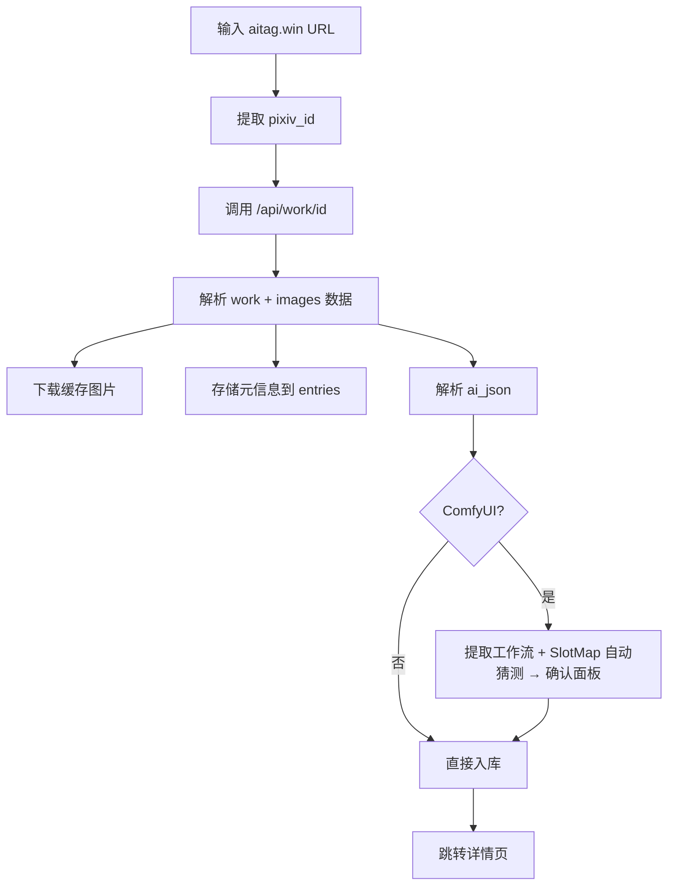
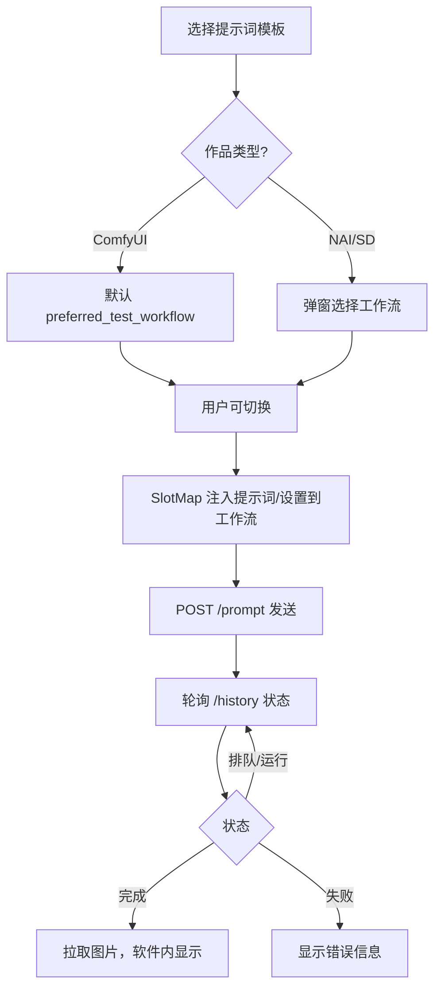

# PromptForge —— AI 绘画提示词管理工具 · 软件需求文档

> **文档版本**：v2.0（融合 Gemini / GPT 方案精华）  
> **创建日期**：2026-03-05  
> **项目类型**：Electron 桌面应用（个人自用工具）

---

## 一、项目概述

### 1.1 背景

用户正在学习 ComfyUI AI 绘画，通过 [AI TAG Prompt Art Gallery](https://aitag.win/) 网站收集全网开源提示词。该网站收录了来自 Pixiv 的 AI 绘画作品，涵盖 **NAI（NovelAI）**、**SD（Stable Diffusion）**、**ComfyUI** 三大类，并提供了完整的提示词参数和示例图片。

### 1.2 核心目标

1. **规范整理** aitag.win 网站上的提示词数据
2. **AI 智能分析** 提示词，自动提取通用模板（画师串、光影词、质量词等）
3. **对接云端 ComfyUI**，实现提示词模板的直接测试与验证
4. **本地化收藏管理**，弥补原网站没有收藏功能的不足
5. **ComfyUI 为"一等公民"**：工作流是核心资产（原图工作流 → 纯净工作流 → 工作流库 → 一键测试）

### 1.3 技术选型

| 层面             | 技术方案                                                                                       |
| ---------------- | ---------------------------------------------------------------------------------------------- |
| **应用框架**     | Electron                                                                                       |
| **前端框架**     | 由开发者根据实际情况选择（React / Vue / 其他）                                                 |
| **本地数据库**   | SQLite（通过 better-sqlite3 或 Prisma）                                                        |
| **AI 大模型**    | 支持多种 OpenAI 兼容格式 API 可切换（OpenAI / DeepSeek / 通义千问 / 智谱 / Ollama 本地模型等） |
| **ComfyUI 对接** | ComfyUI REST API（通过 AutoDL 6006 端口公网映射，无鉴权）                                      |
| **远程文件**     | SSH 密码登录，读取云端 LoRA/LyCORIS 模型列表                                                   |

---

## 二、数据来源分析

### 2.1 aitag.win 网站结构

| 项目              | 详情                                                                   |
| ----------------- | ---------------------------------------------------------------------- |
| **首页**          | `https://aitag.win/`                                                   |
| **作品详情页**    | `https://aitag.win/i/{pixiv_id}`                                       |
| **作品列表 API**  | `GET /api/ai_works_search?page=1&page_size=60&sort=new&time_range=all` |
| **作品详情 API**  | `GET /api/work/{pixiv_id}`                                             |
| **图片 URL 模式** | `https://aitag.win/{TYPE}/{AUTHOR_ID}/{PIXIV_ID}_p{INDEX}.webp`        |

### 2.2 API 返回数据结构

```
work:
  ├── id              → Pixiv ID
  ├── userid          → 作者 ID
  ├── title           → 作品标题
  ├── caption         → 作品简介
  ├── tags            → 标签数组（JSON 字符串）
  ├── create_date     → 投稿时间
  └── views, bookmarks 等统计

images[]:
  ├── ai_json         → 完整提示词参数（JSON 字符串）
  ├── prompt_text     → 正向提示词原文
  └── image URL 信息
```

### 2.3 三种数据格式差异

| 类型        | 数据格式                                                                  | 关键字段                                                                                       |
| ----------- | ------------------------------------------------------------------------- | ---------------------------------------------------------------------------------------------- |
| **NAI**     | 标准 JSON，`Description` + `Comment`                                      | prompt, uc(反向), steps, height, width, scale, sampler, seed, cfg_rescale, v4_prompt(角色分区) |
| **SD**      | `parameters` 单字段纯文本                                                 | 正向提示词 / Negative prompt / Steps / Sampler / CFG / Model / LoRA / Seed / Size              |
| **ComfyUI** | 完整工作流 JSON（节点 + 连线），可能是 API prompt 格式或 UI workflow 格式 | checkpoint名, LoRA名, 正/负提示词, steps, cfg, sampler, scheduler, width, height               |

> **ComfyUI 补充说明**（借鉴 GPT 方案）：
> - **API prompt 格式**：顶层是 `node_id → {class_type, inputs}`
> - **UI workflow 格式**：顶层含 `nodes/links`
> - 一段粘贴文本中可能包含两种格式拼接，解析器需做"多 JSON 串行解析"

---

## 三、功能模块设计

### 模块 1：数据导入

#### 1.1 手动粘贴导入
- 支持粘贴 **单条 JSON** 或 **多条 JSON**（空行分隔），自动识别拆分
- 自动识别数据类型（NAI / SD / ComfyUI）
- ComfyUI 数据自动区分 API prompt 格式和 UI workflow 格式

#### 1.2 文件批量导入
- 支持 `.txt` / `.json` 文件导入，自动拆分多条记录

#### 1.3 网址直接导入（核心功能）
- 输入 `https://aitag.win/i/{pixiv_id}`
- 自动调用 `/api/work/{id}` 获取完整数据
- 自动下载并缓存所有示例图片到本地
- 一并存储原始数据 + 图片 + 元信息

---

### 模块 2：原始数据管理（Raw Data Dashboard）

参照 aitag.win 网站模式，分为**作品信息区**和**原始代码区**两个子区域：

#### 2.1 作品信息区（元数据卡片）

| 字段                | 说明                                                             |
| ------------------- | ---------------------------------------------------------------- |
| **Pixiv ID**        | 可点击跳转原始 Pixiv 页面                                        |
| **作者 ID / 昵称**  | 可点击以此作者为关键词在本地库搜索                               |
| **类型**            | NAI / SD / ComfyUI（胶囊标签样式）                               |
| **标签**            | 解析为可点击的 UI Pills（如 R-18、角色名等），点击可按此标签搜索 |
| **作品简介**        | 作者原始说明文字                                                 |
| **投稿时间**        | 原始发布时间                                                     |
| **浏览数 / 收藏数** | 原网站统计                                                       |
| **示例图片**        | 本地缓存的图片（Gallery 预览）                                   |
| **来源 URL**        | 原始链接                                                         |

#### 2.2 原始代码区
- 原封不动展示抓取到的 JSON / 纯文本参数
- 支持**一键全部复制**
- 对 ComfyUI 类型，高亮关键节点（KSampler / CLIPTextEncode / LoRA Loader 等）

---

### 模块 3：AI 智能整理

#### 3.1 自动分析
将原始提示词发送给 AI 大模型，自动拆分并输出**严格 JSON 格式**：

| 类别                 | 说明                           | 示例                               |
| -------------------- | ------------------------------ | ---------------------------------- |
| **画师串**           | artist tags                    | `artist:tamagoroo`                 |
| **光影词**           | 光照/氛围                      | `dramatic lighting`, `rim light`   |
| **质量词**           | 画质增强                       | `masterpiece`, `best quality`      |
| **风格词**           | 画风描述                       | `flat color`, `pixel art`          |
| **通用设置**         | 模型/采样/参数                 | 大模型名、LoRA/权重、steps、cfg 等 |
| **removed_specific** | 被移除的非通用内容（保留存档） | 角色名、具体动作、具体背景         |

> 每个条目附带 **置信度分数**（借鉴 GPT 方案），置信度低的标黄提示用户手动校正。

#### 3.2 可视化模板编辑器（重点功能）
- AI 整理后以**表格/表单**形式展示
- 每行字段：`text / weight / enabled / note / 来源(LLM/手动) / 置信度`
- 每个分类可**增删改**，像填表一样操作
- 可自由**新增自定义分类**（如"构图词"、"色彩词"等）
- 发送给 AI 的分析提示词（System Prompt）**本身也可编辑**
- 模板保存后可在其他作品上复用

#### 3.3 NSFW 内容安全处理（借鉴 GPT 方案）

> ⚠️ 原始数据中可能包含 R-18/NSFW 词汇，某些云端 LLM 会拒绝处理。

提供两种模式可切换：
- **脱敏模式**：发送前自动移除 NSFW 内容，仅提取设置/画师串/质量词
- **完整模式**：发送完整提示词（适用于无审核的本地模型或兼容 API）

#### 3.4 大模型配置
- 支持多个 AI 模型 API，统一使用 OpenAI 兼容格式
- 可配置：API Key、Endpoint、Model Name、Temperature 等
- 支持 Ollama 本地模型（自定义 endpoint）

---

### 模块 4：收藏系统

#### 4.1 收藏功能
- ⭐ 一键收藏 / 取消收藏
- **自定义标签系统**：可创建任意标签，支持颜色自定义，一个作品可打多个标签
- 支持备注和评分

#### 4.2 收藏浏览与筛选
- 按标签 / 类型 / 作者 / 画风 / LoRA / 模型筛选
- **"只看缺 LoRA"** 快速筛选（借鉴 GPT 方案）
- Gallery 式图片预览

#### 4.3 标签云（借鉴 Gemini 方案）
- 首页展示**全局标签云**，聚合统计所有作品的标签
- 一眼看出最近收集最多的角色、画风是什么

---

### 模块 5：Civitai 集成

#### 5.1 LoRA / Checkpoint 自动匹配
- 提取 LoRA 和 Checkpoint 文件名
- 调用 Civitai API 搜索匹配
- 展示：C 站名称 + 页面链接 + 基本信息（评分、下载量）

---

### 模块 6：ComfyUI 云端对接

#### 6.1 连接配置
- 公网 URL（AutoDL 映射 `https://xxx.seetacloud.com:8443`，无鉴权）
- 连接状态检测（在线/离线指示）
- History 路由可配置（不同 ComfyUI 版本路径可能不同）

#### 6.2 提示词模板测试
1. 选择提示词模板
2. **ComfyUI 来源** → 默认该作品的 `preferred_test_workflow`（默认 clean）
3. **NAI/SD 来源** → 弹窗选择工作流（记住上次选择）
4. 用户可自由切换其他工作流
5. 通过 **SlotMap** 将提示词注入工作流 → `POST /prompt` 发送
6. 轮询 `GET /history/{prompt_id}` 获取进度（排队/运行/完成/失败）
7. 拉取图片并在软件内直接显示
8. 右侧图片区可切换：**网站示例图 ↔ 生成结果图**

#### 6.3 错误处理（借鉴 GPT 方案）
- `/prompt` 超时 → 提示"服务不可达/URL 配置错误"
- 任务状态 → 至少显示"排队/运行/完成/失败"
- History 路由不匹配 → 引导用户在设置中修改路径

#### 6.4 LoRA 存在性检测
- **SSH 密码登录**连接云端服务器
- 读取 `models/loras/` **和 `models/lycoris/`**（借鉴 GPT 方案）目录
- 一次性读取后**缓存到本地数据库**，支持手动刷新
- 作品详情页标记：✅ 已存在 / ❌ 缺失（+Civitai 下载链接）

#### 6.5 SSH 配置
- Host / Port / Username / Password（加密存储）
- ComfyUI 根目录路径（可配置）
- LoRA 扫描路径可自定义（默认 `models/loras` + `models/lycoris`）

---

### 模块 7：工作流管理（ComfyUI 专属·核心功能）

#### 7.1 工作流提取与存储
- 导入时自动提取并存储：
  - `original_json`：原始工作流
  - `api_prompt_json`：如果识别到 API prompt 格式则存储（远程运行优先用它）

#### 7.2 插槽映射系统 SlotMap（借鉴 GPT 方案·关键设计）

为实现"自动猜测 + 手动可改"的提示词注入，引入 SlotMap 概念：

```
slot_map:
  ├── positive_slots:  [{node_id, path: "inputs.text"}]     ← CLIPTextEncode 正向
  ├── negative_slots:  [{node_id, path: "inputs.text"}]     ← CLIPTextEncode 反向
  ├── sampler_slots:   [{node_id, keys: [steps, cfg, ...]}] ← KSampler
  ├── model_slots:     [{node_id, path: "inputs.ckpt_name"}]← CheckpointLoader
  └── lora_slots:      [{node_id, fields: [lora_name, ...]}]← LoRA/LyCORIS Loader
```

**自动猜测规则**：
- 正向提示词 → `class_type="CLIPTextEncode"` 的 `inputs.text`，用 `_meta.title` 区分正/负
- 采样器 → `class_type="KSampler"` 节点
- 模型 → `CheckpointLoaderSimple.inputs.ckpt_name`
- LoRA → `LycorisLoaderNode` / `LoraLoader` 节点

**导入时弹出"插槽确认面板"**，展示自动猜测结果，用户可修改后确认。

#### 7.3 工作流净化与导出

**净化时弹窗选择**（借鉴 GPT 方案），默认勾选项：
- ✅ 清空正/负提示词为占位符 `{{positive}}` / `{{negative}}`
- ✅ seed 随机化（设为 -1）
- ✅ LoadImage 清空具体文件名
- ☐ 清理 UI 噪声字段（pos/size/order 等，可选）

输出 `clean_json` 同时保持 `original_json` 不动。

**导出格式**：
- 标准 ComfyUI 工作流 `.json`，可直接拖入 ComfyUI 使用
- 可选导出 Original 或 Clean 版本

#### 7.4 工作流选择器
- 列表展示：模板名、来源作品、关键节点概览（提示词槽位数、KSampler 数、是否含 ControlNet/Detailer/Upscale）
- 支持设为"**默认测试工作流**"（供 SD/NAI 条目使用）

---

### 模块 8：设置中心

| 设置项            | 说明                                                   |
| ----------------- | ------------------------------------------------------ |
| **AI 大模型配置** | 多模型管理，API Key/Endpoint/Model/Temperature         |
| **ComfyUI 连接**  | 公网 URL、History 路由路径、超时设置                   |
| **SSH 连接**      | Host/Port/User/Password、ComfyUI 根目录、LoRA 扫描路径 |
| **存储路径**      | 图片缓存目录、数据库路径                               |
| **分析模板**      | AI 分析 System Prompt 模板管理                         |
| **Civitai**       | API Token                                              |
| **NSFW 处理**     | 脱敏模式 / 完整模式切换                                |

---

## 四、数据库设计

```
entries（作品条目表）
├── id TEXT PK
├── pixiv_id TEXT
├── author_id TEXT
├── author_name TEXT
├── title TEXT
├── caption TEXT
├── type TEXT (NAI/SD/ComfyUI)
├── tags JSON
├── source_url TEXT
├── source_site TEXT (默认 aitag.win)
├── post_date DATETIME
├── views INT
├── bookmarks INT
├── raw_json TEXT (原始完整数据)
├── is_favorite BOOLEAN (默认 false)
├── favorite_note TEXT
├── favorite_rating INT
├── created_at / updated_at

images（图片表）
├── id TEXT PK
├── entry_id FK → entries
├── index INT
├── original_url TEXT
├── local_path TEXT
├── ai_json TEXT (该图片的提示词JSON)
├── prompt_text TEXT

analyzed_templates（AI 分析结果表）
├── id TEXT PK
├── entry_id FK → entries
├── template_json TEXT (分类提示词模板，含置信度)
├── removed_specific JSON (被移除的非通用词，保留存档)
├── settings_common JSON (通用设置：steps/cfg/sampler等)
├── custom_categories JSON
├── ai_model_used TEXT
├── created_at

user_tags（用户标签定义表）
├── id TEXT PK
├── name TEXT
├── color TEXT
├── created_at

entry_tags（条目-标签关联表）
├── entry_id FK → entries
├── tag_id FK → user_tags

workflows（工作流表）
├── id TEXT PK
├── name TEXT
├── tags JSON
├── notes TEXT
├── original_json TEXT
├── clean_json TEXT
├── api_prompt_json TEXT (可为空)
├── slot_map_json TEXT
├── derived_from_entry_id FK → entries (可为空)
├── is_default_test BOOLEAN (默认false)
├── created_at / updated_at

entry_workflow_binding（条目-工作流绑定表）
├── entry_id TEXT PK → entries
├── original_workflow_id FK → workflows
├── clean_workflow_id FK → workflows
├── preferred_test_workflow_id FK → workflows

remote_profiles（远程连接配置表）
├── id TEXT PK
├── comfy_base_url TEXT
├── comfy_history_route TEXT (默认 /history)
├── ssh_host TEXT
├── ssh_port INT
├── ssh_user TEXT
├── ssh_password_encrypted BLOB
├── comfy_root_path TEXT
├── loras_paths JSON (默认 ["models/loras", "models/lycoris"])

remote_lora_index（远程 LoRA 索引表）
├── profile_id FK → remote_profiles
├── filename TEXT
├── path TEXT
├── file_size INT
├── last_synced_at DATETIME
├── civitai_url TEXT
├── civitai_name TEXT
├── PK(profile_id, path, filename)

ai_model_configs（AI 模型配置表）
├── id TEXT PK
├── name TEXT
├── provider TEXT (openai/deepseek/qwen/glm/ollama)
├── endpoint TEXT
├── api_key_encrypted BLOB
├── model_name TEXT
├── temperature REAL
├── is_default BOOLEAN
```

---

## 五、界面结构

### 5.1 三栏主界面（作品详情工作台）

```
┌────────────┬─────────────────────────┬──────────────────┐
│            │                         │                  │
│  条目列表   │   中栏：通用模板表单      │  右栏：学习对照   │
│            │   (可编辑)               │                  │
│  搜索/筛选  │                         │  ┌──────────────┐│
│  ─────── │   画师串 │ text │ weight │ │  示例图 / 生成 ││
│  类型筛选   │   质量词 │ ... │ ...   │ │  结果图 切换   ││
│  收藏筛选   │   光影词 │ ... │ ...   │ │              ││
│  缺LoRA    │   风格词 │ ... │ ...   │ ├──────────────┤│
│            │   [+新增分类]            │ │  作品信息卡    ││
│            │                         │ │  (元数据)      ││
│            │   ── 通用设置 ──         │ ├──────────────┤│
│            │   模型/LoRA/Steps/CFG   │ │  原始 JSON     ││
│            │                         │ │  (高亮+可复制)  ││
│            │   [AI分析] [测试] [导出]  │ └──────────────┘│
└────────────┴─────────────────────────┴──────────────────┘
```

### 5.2 主要页面

| 页面           | 功能                                         |
| -------------- | -------------------------------------------- |
| **导入页**     | 粘贴 JSON / 输入网址 / 导入文件              |
| **浏览页**     | Gallery 模式 + 标签云 + 按类型/标签/作者筛选 |
| **作品详情页** | 三栏工作台（如上图）                         |
| **收藏页**     | 按标签/文件夹分类浏览                        |
| **工作流页**   | 管理工作流模板，导出/设为默认                |
| **测试页**     | 选择模板+工作流 → ComfyUI 跑图 → 查看结果    |
| **设置页**     | 全局配置                                     |

---

## 六、关键交互流程

### 6.1 网址一键导入



### 6.2 ComfyUI 测试 



---

## 七、注意事项

1. **隐私安全**：API Key 和 SSH 密码加密存储
2. **网络降级**：ComfyUI 离线时不影响本地浏览和整理
3. **NSFW 安全**：LLM 调用前可选脱敏处理
4. **数据备份**：支持数据库导出/导入
5. **版权声明**：仅限个人学习使用

---

## 八、开发优先级

| 优先级 | 模块                                 | 说明     |
| ------ | ------------------------------------ | -------- |
| 🔴 P0   | 数据导入（粘贴+网址+文件）           | 核心入口 |
| 🔴 P0   | 原始数据管理 + 浏览 + 数据库         | 基础设施 |
| 🟡 P1   | AI 智能整理 + 可视化模板编辑器       | 核心价值 |
| 🟡 P1   | 收藏系统（标签+标签云）              | 强需求   |
| 🟡 P1   | ComfyUI 工作流提取/SlotMap/净化/导出 | 主战场   |
| 🟢 P2   | ComfyUI 云端测试                     | 进阶     |
| 🟢 P2   | SSH LoRA 存在性检测                  | 进阶     |
| 🟢 P2   | Civitai LoRA/Checkpoint 匹配         | 增强体验 |
| ⚪ P3   | 标签云 / 作者订阅（未来）            | 锦上添花 |

---

## 九、后续扩展建议（借鉴 Gemini 方案）

1. **作者快速订阅**：监控特定作者的更新，自动抓取并存入本地
2. **全局标签统计看板**：可视化你的提示词收集习惯和偏好趋势
3. **模板市场**：导出/导入整理好的提示词模板，方便与社区分享
