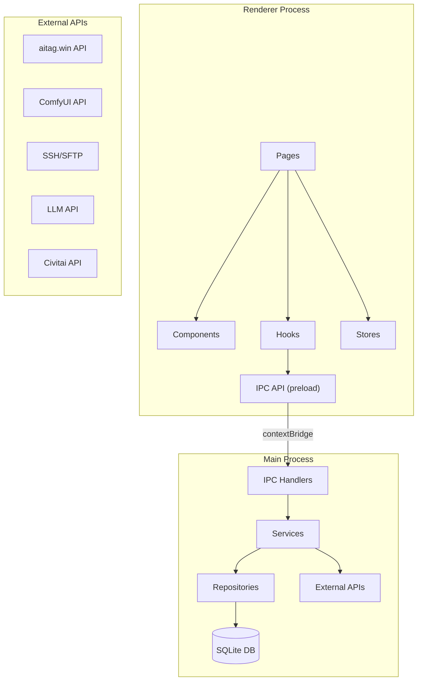

# PromptForge · 技术架构文档

> **版本**：v1.0 | **日期**：2026-03-05

---

## 一、整体架构

### 1.1 架构模式

采用 **Electron 主进程 + 渲染进程** 双层架构，通过 IPC 通信桥接：

```
┌──────────────────────────────────────────────────────┐
│                    Electron App                       │
│  ┌────────────────────────────────────────────────┐  │
│  │           Renderer Process (UI)                 │  │
│  │  ┌──────────┬──────────┬──────────┬──────────┐ │  │
│  │  │  Pages   │Components│  Store   │  Hooks   │ │  │
│  │  └──────────┴──────────┴──────────┴──────────┘ │  │
│  └───────────────────┬────────────────────────────┘  │
│                      │ IPC (contextBridge)            │
│  ┌───────────────────┴────────────────────────────┐  │
│  │           Main Process (Backend)                │  │
│  │  ┌──────────┬──────────┬──────────┬──────────┐ │  │
│  │  │ DB Layer │ Scraper  │ SSH Mgr  │ LLM Svc  │ │  │
│  │  │ (SQLite) │(aitag)   │(LoRA)    │(Multi)   │ │  │
│  │  ├──────────┼──────────┼──────────┼──────────┤ │  │
│  │  │ ComfyUI  │ Civitai  │ Workflow │ Parser   │ │  │
│  │  │ Client   │ Client   │ Engine   │ Engine   │ │  │
│  │  └──────────┴──────────┴──────────┴──────────┘ │  │
│  └────────────────────────────────────────────────┘  │
└──────────────────────────────────────────────────────┘
```

### 1.2 进程职责

| 进程                 | 职责                                                                    |
| -------------------- | ----------------------------------------------------------------------- |
| **Main Process**     | SQLite 读写、网络请求（爬取/API）、SSH 连接、文件系统操作、图片缓存管理 |
| **Renderer Process** | UI 渲染、用户交互、状态管理、表单编辑                                   |
| **Preload Script**   | 通过 `contextBridge` 暴露安全的 IPC API 给渲染进程                      |

---

## 二、项目目录结构

```
promptforge/
├── package.json
├── electron-builder.yml          # 打包配置
├── tsconfig.json
│
├── src/
│   ├── main/                     # ═══ Electron 主进程 ═══
│   │   ├── index.ts              # 入口，创建窗口
│   │   ├── ipc/                  # IPC 处理器注册
│   │   │   ├── entries.ipc.ts    # 条目相关 IPC
│   │   │   ├── workflows.ipc.ts
│   │   │   ├── scraper.ipc.ts
│   │   │   ├── comfyui.ipc.ts
│   │   │   ├── ssh.ipc.ts
│   │   │   ├── llm.ipc.ts
│   │   │   ├── civitai.ipc.ts
│   │   │   └── settings.ipc.ts
│   │   │
│   │   ├── db/                   # 数据库层
│   │   │   ├── database.ts       # SQLite 初始化/连接
│   │   │   ├── migrations/       # 数据库迁移脚本
│   │   │   └── repositories/     # 数据访问对象
│   │   │       ├── entries.repo.ts
│   │   │       ├── images.repo.ts
│   │   │       ├── workflows.repo.ts
│   │   │       ├── tags.repo.ts
│   │   │       ├── lora-cache.repo.ts
│   │   │       └── settings.repo.ts
│   │   │
│   │   ├── services/             # 业务逻辑层
│   │   │   ├── scraper/          # aitag.win 爬取
│   │   │   │   ├── aitag-client.ts
│   │   │   │   └── image-downloader.ts
│   │   │   ├── parser/           # 提示词解析引擎
│   │   │   │   ├── nai-parser.ts
│   │   │   │   ├── sd-parser.ts
│   │   │   │   ├── comfyui-parser.ts
│   │   │   │   └── auto-detect.ts
│   │   │   ├── llm/              # AI 大模型服务
│   │   │   │   ├── llm-service.ts
│   │   │   │   ├── providers/    # 各模型 provider
│   │   │   │   └── prompts/      # System Prompt 模板
│   │   │   ├── comfyui/          # ComfyUI 云端对接
│   │   │   │   ├── comfyui-client.ts
│   │   │   │   ├── workflow-engine.ts
│   │   │   │   └── slot-map.ts
│   │   │   ├── ssh/              # SSH 连接管理
│   │   │   │   └── ssh-manager.ts
│   │   │   ├── civitai/          # Civitai API
│   │   │   │   └── civitai-client.ts
│   │   │   └── crypto/           # 加密服务
│   │   │       └── encrypt.ts
│   │   │
│   │   └── utils/
│   │       ├── paths.ts          # 路径工具
│   │       └── logger.ts
│   │
│   ├── preload/                  # ═══ Preload 脚本 ═══
│   │   └── index.ts              # contextBridge API 导出
│   │
│   ├── renderer/                 # ═══ 渲染进程 (UI) ═══
│   │   ├── index.html
│   │   ├── main.tsx              # UI 入口
│   │   ├── App.tsx
│   │   ├── router.tsx            # 路由配置
│   │   │
│   │   ├── pages/                # 页面组件
│   │   │   ├── ImportPage/
│   │   │   ├── BrowsePage/
│   │   │   ├── DetailPage/       # 三栏工作台
│   │   │   ├── FavoritesPage/
│   │   │   ├── WorkflowPage/
│   │   │   ├── TestPage/
│   │   │   └── SettingsPage/
│   │   │
│   │   ├── components/           # 通用组件
│   │   │   ├── common/           # Button, Modal, Tag, etc.
│   │   │   ├── layout/           # Sidebar, ThreeColumn, etc.
│   │   │   ├── entry/            # SourceCard, RawPayload...
│   │   │   ├── template/         # TemplateEditor, SlotRow...
│   │   │   ├── workflow/         # WorkflowList, SlotMapEditor...
│   │   │   └── gallery/          # ImageGallery, TagCloud...
│   │   │
│   │   ├── hooks/                # 自定义 Hooks
│   │   ├── stores/               # 状态管理
│   │   ├── styles/               # 全局样式
│   │   │   ├── variables.css
│   │   │   ├── global.css
│   │   │   └── themes/
│   │   └── types/                # TypeScript 类型定义
│   │       ├── entry.ts
│   │       ├── workflow.ts
│   │       ├── template.ts
│   │       └── ipc.ts
│   │
│   └── shared/                   # ═══ 主进程/渲染进程共享 ═══
│       ├── constants.ts
│       ├── types/                # 共享类型定义
│       │   ├── entry.types.ts
│       │   ├── workflow.types.ts
│       │   └── api.types.ts
│       └── ipc-channels.ts      # IPC 频道名常量
│
├── resources/                    # 静态资源（图标等）
├── data/                         # 运行时数据（开发环境）
│   ├── promptforge.db            # SQLite 数据库
│   └── cache/                    # 图片缓存
└── tests/
```

---

## 三、模块依赖图



---

## 四、IPC 通信设计

### 4.1 通信模式

所有 Renderer → Main 通信通过 `ipcRenderer.invoke()` / `ipcMain.handle()` 模式（Promise-based）。

### 4.2 频道命名规范

```typescript
// src/shared/ipc-channels.ts
export const IPC = {
  // 条目管理
  ENTRY_IMPORT_PASTE:    'entry:import:paste',
  ENTRY_IMPORT_URL:      'entry:import:url',
  ENTRY_IMPORT_FILE:     'entry:import:file',
  ENTRY_LIST:            'entry:list',
  ENTRY_GET:             'entry:get',
  ENTRY_DELETE:          'entry:delete',
  ENTRY_SEARCH:          'entry:search',

  // 收藏
  FAVORITE_TOGGLE:       'favorite:toggle',
  FAVORITE_LIST:         'favorite:list',
  TAG_CREATE:            'tag:create',
  TAG_LIST:              'tag:list',
  TAG_ASSIGN:            'tag:assign',

  // AI 分析
  LLM_ANALYZE:           'llm:analyze',
  LLM_CONFIG_LIST:       'llm:config:list',
  LLM_CONFIG_SAVE:       'llm:config:save',

  // 工作流
  WORKFLOW_LIST:         'workflow:list',
  WORKFLOW_GET:          'workflow:get',
  WORKFLOW_CLEAN:        'workflow:clean',
  WORKFLOW_EXPORT:       'workflow:export',
  WORKFLOW_SET_DEFAULT:  'workflow:setDefault',
  SLOTMAP_GUESS:         'slotmap:guess',
  SLOTMAP_SAVE:          'slotmap:save',

  // ComfyUI
  COMFY_TEST_CONNECTION: 'comfy:testConnection',
  COMFY_SUBMIT:          'comfy:submit',
  COMFY_STATUS:          'comfy:status',
  COMFY_CANCEL:          'comfy:cancel',

  // SSH / LoRA
  SSH_SCAN_LORAS:        'ssh:scanLoras',
  LORA_CHECK:            'lora:check',

  // Civitai
  CIVITAI_SEARCH:        'civitai:search',

  // 设置
  SETTINGS_GET:          'settings:get',
  SETTINGS_SAVE:         'settings:save',
} as const;
```

### 4.3 IPC 返回格式统一

```typescript
interface IPCResponse<T> {
  success: boolean;
  data?: T;
  error?: {
    code: string;
    message: string;
  };
}
```

---

## 五、数据库层设计

### 5.1 SQLite 初始化

```typescript
// src/main/db/database.ts
import Database from 'better-sqlite3';
import path from 'path';
import { app } from 'electron';

const DB_PATH = path.join(app.getPath('userData'), 'promptforge.db');

export function initDatabase(): Database.Database {
  const db = new Database(DB_PATH);
  db.pragma('journal_mode = WAL');       // 写入性能优化
  db.pragma('foreign_keys = ON');        // 启用外键
  runMigrations(db);
  return db;
}
```

### 5.2 Repository 模式

每个数据表对应一个 Repository 类，封装所有 CRUD 操作：

```typescript
// 示例：entries.repo.ts
export class EntriesRepository {
  constructor(private db: Database.Database) {}

  create(entry: CreateEntryDTO): Entry { ... }
  findById(id: string): Entry | null { ... }
  list(filters: EntryFilters): PaginatedResult<Entry> { ... }
  search(query: string): Entry[] { ... }
  update(id: string, data: UpdateEntryDTO): void { ... }
  delete(id: string): void { ... }
  toggleFavorite(id: string): void { ... }
}
```

---

## 六、外部服务集成

### 6.1 aitag.win 爬取器

```typescript
class AitagClient {
  baseUrl = 'https://aitag.win';

  async fetchWork(pixivId: string): Promise<AitagWork>
  async downloadImage(url: string, savePath: string): Promise<void>
}
```

### 6.2 ComfyUI Client

```typescript
class ComfyUIClient {
  constructor(private baseUrl: string)  // e.g. https://xxx.seetacloud.com:8443

  async testConnection(): Promise<boolean>
  async submitPrompt(promptJson: object): Promise<{ prompt_id: string }>
  async getHistory(promptId: string): Promise<HistoryResult>
  async getImage(filename: string, subfolder: string, type: string): Promise<Buffer>
}
```

### 6.3 SSH Manager

```typescript
class SSHManager {
  async connect(config: SSHConfig): Promise<void>
  async listDirectory(remotePath: string): Promise<FileEntry[]>
  async scanLoras(config: SSHConfig, paths: string[]): Promise<LoraFile[]>
  disconnect(): void
}
```

### 6.4 LLM Service

```typescript
class LLMService {
  // 统一 OpenAI 兼容格式
  async analyze(prompt: string, config: LLMConfig): Promise<AnalysisResult>
  sanitizeForNSFW(prompt: string): string  // 脱敏处理
}
```

---

## 七、状态管理

渲染进程建议使用轻量级状态管理（如 Zustand）：

```
stores/
├── useEntryStore.ts      # 当前条目列表/筛选状态
├── useDetailStore.ts     # 当前查看的条目详情
├── useWorkflowStore.ts   # 工作流列表/选中状态
├── useTestStore.ts       # ComfyUI 测试状态（进度/结果）
├── useFavoriteStore.ts   # 收藏/标签状态
└── useSettingsStore.ts   # 全局设置
```

---

## 八、打包配置

```yaml
# electron-builder.yml
appId: com.promptforge.app
productName: PromptForge
win:
  target: nsis
  icon: resources/icon.ico
nsis:
  oneClick: false
  allowToChangeInstallationDirectory: true
files:
  - dist/**/*
  - resources/**/*
extraResources:
  - from: data/
    to: data/
```

---

## 九、安全规范

1. **API Key 存储**：使用 `safeStorage` (Electron) 加密存储，不明文写入 SQLite
2. **SSH 密码**：同样使用 `safeStorage` 加密
3. **contextBridge**：仅暴露必要的 IPC 方法，不暴露 `ipcRenderer` 原始对象
4. **CSP**：渲染进程设置 Content Security Policy，限制外部脚本加载
5. **nodeIntegration**：渲染进程禁用，仅通过 preload 访问 Node API
